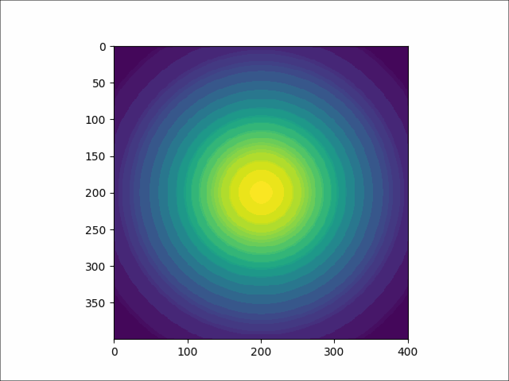
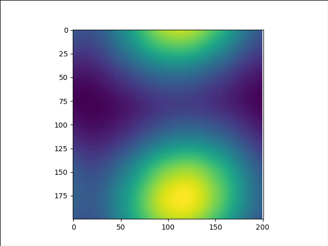
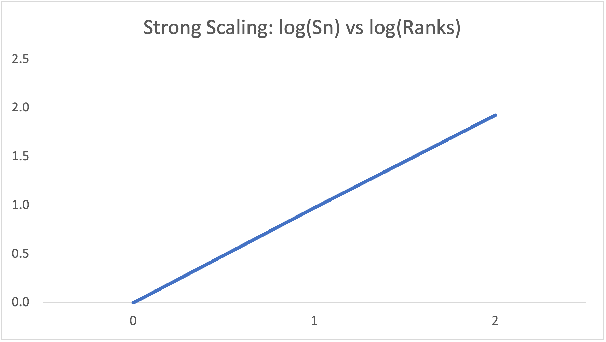
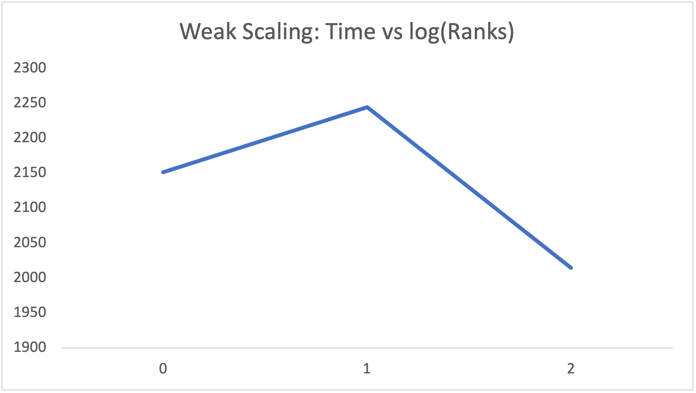

### Description of parallel startergy
* Divide N * N matrix into np ranks with each rank having num_threads threads executing 

### Demonstration of correctness N = 400 
* Lax

* First Order

* Second Order

### Non uniform u and v
* u and v linearly dependent on 1/x and 1/y

### Performance Analysis

- Strong Scaling

| No of RANKS                   | 1      | 4    | 16    |
| ----------------------------- | ------ | ---- | ----- |
| Log(Ranks) (log ranks base 4) | 0      | 1    | 2     |
| Time (sec)                    | 5394.4 | 1392 | 371.9 |
| Strong Scaling (Time/7128.5)  | 1.0    | 3.9  | 14.5  |

- Weak Scaling

| No of RANKS            | 1        | 4        | 16       |
| ---------------------- | -------- | -------- | -------- |
| Log (log ranks base 4) | 0        | 1        | 2        |
| N                      | 5000     | 10000    | 20000    |
| Weak Scaling (sec)     | 2151.471 | 2244.109 | 2014.468 |

| No of RANKS            | 1   | 4   | 16  |
| ---------------------- | --- | --- | --- |
| Grind Rate in Billions | 0.4 | 1.4 | 5.4 |

### Running Code
* Compile - use makefile
* Run : mpirun -np {ranks} ./{exectuable} N NT L T u v
