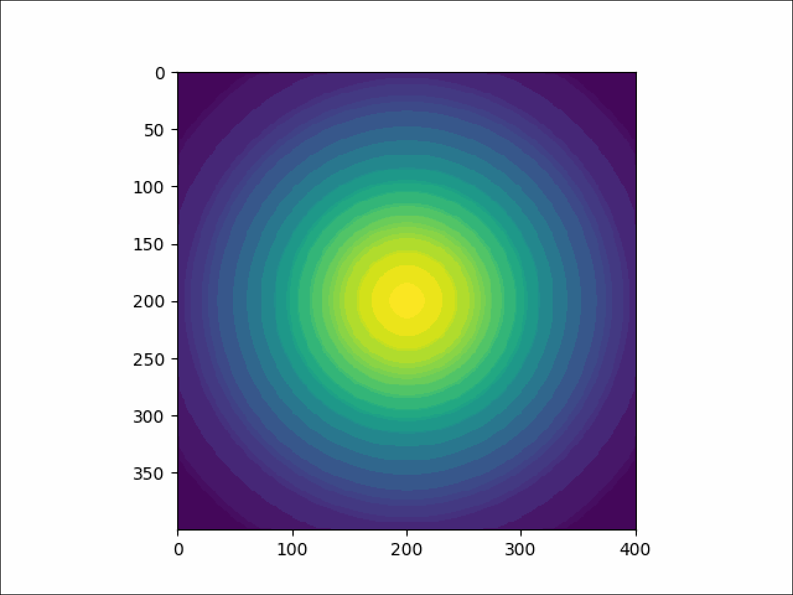
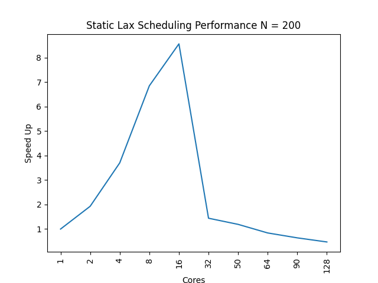
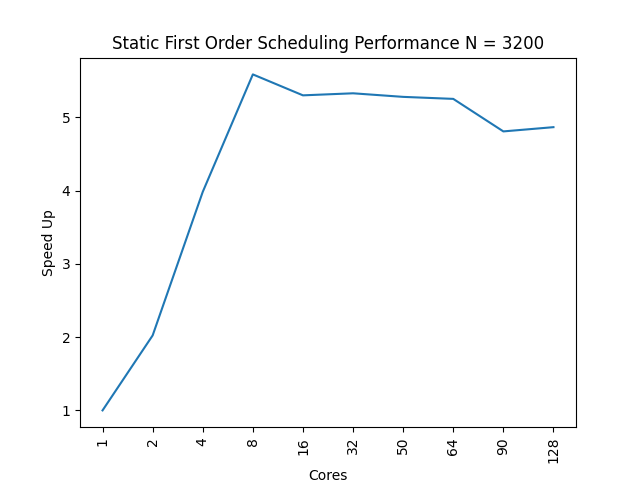
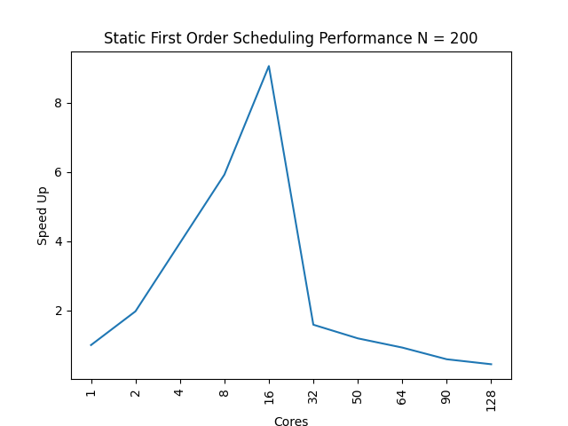
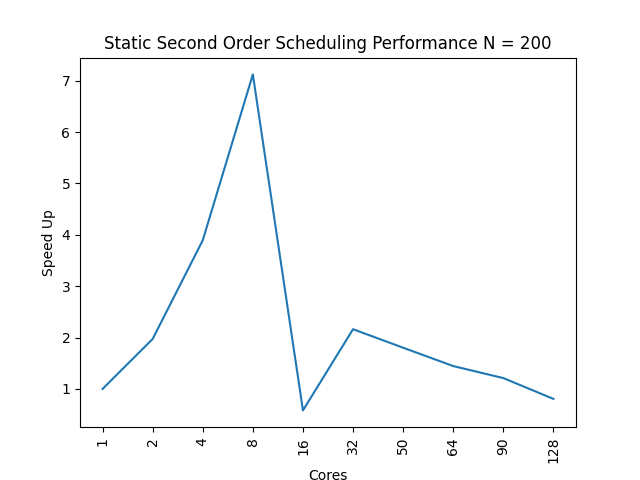
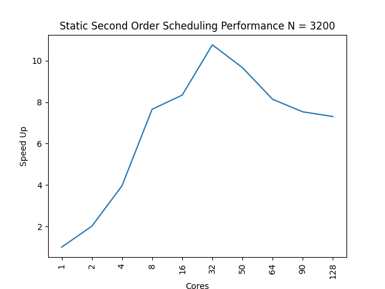
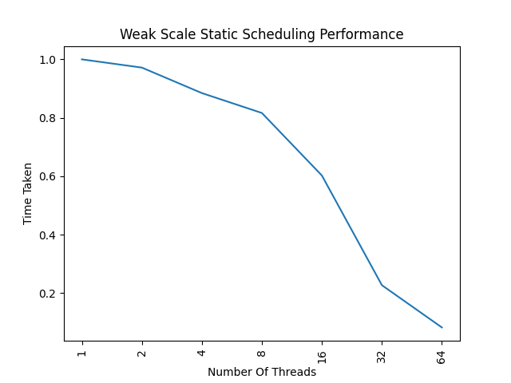

### Compiling serial code
> make my_advection_program  

### Compiling parallel code
> make my_advection_program_parallel  

### Executing 
> ./my_advection_program 400 20000 1.0 1.0e6 5.0e-7 2.85e-7 lax -1 -1

> ./my_advection_program 400 20000 1.0 1.0e6 5.0e-7 2.85e-7 first_order_upwind -1 -1

> ./my_advection_program 400 20000 1.0 1.0e6 5.0e-7 2.85e-7 second_order_upwind -1 -1

> ./my_advection_program_parallel 400 20000 1.0 1.0e6 5.0e-7 2.85e-7 lax 8 8

> ./my_advection_program_parallel 400 20000 1.0 1.0e6 5.0e-7 2.85e-7 first_order_upwind 8 8

> ./my_advection_program_parallel 400 20000 1.0 1.0e6 5.0e-7 2.85e-7 second_order_upwind 8 8

### Clean
> make clean

* All tests were run on linux.cs.uchicago.edu which has 64 threads avaialble to the user
* compiler used gcc9
* grind rate: 3,636,363,636.3636363636 cells/sec