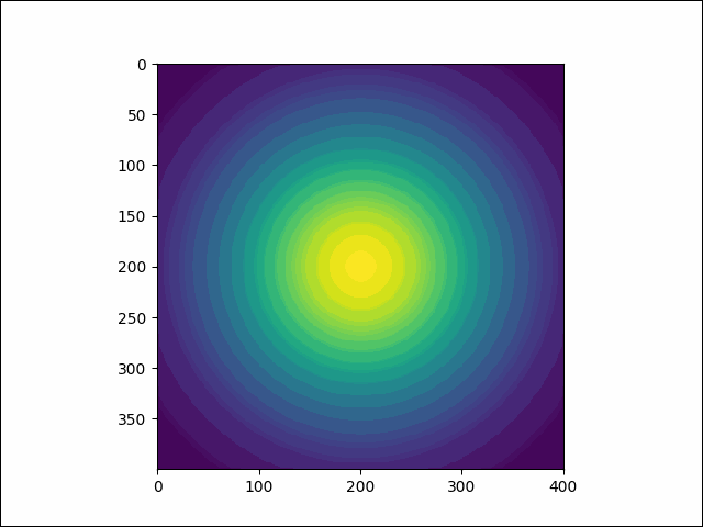
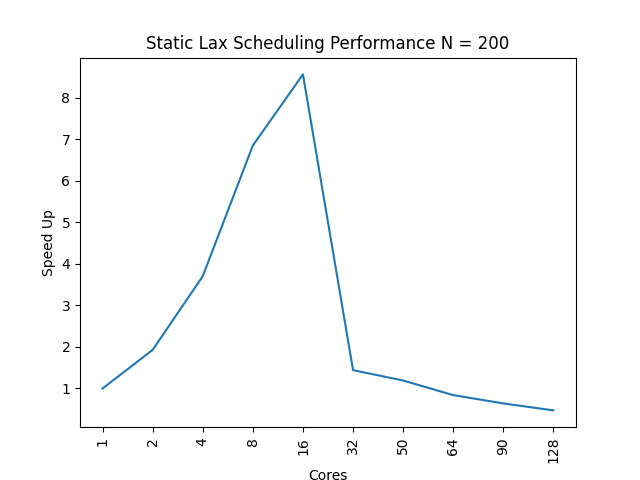
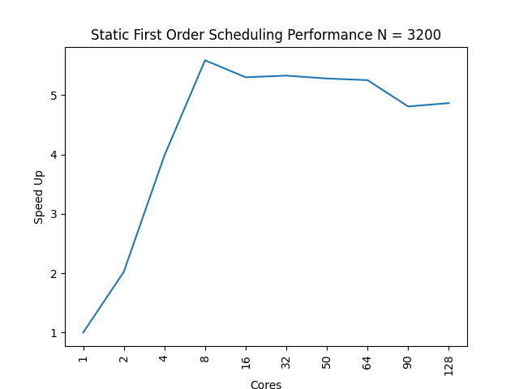
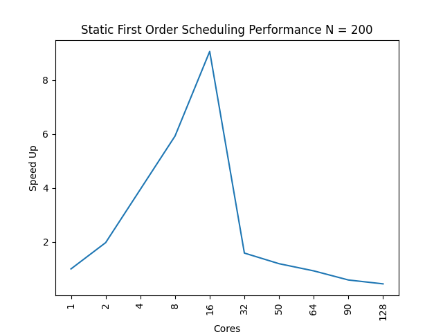
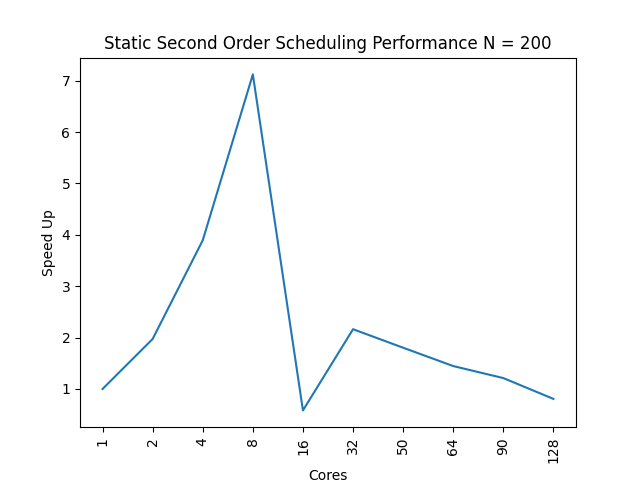
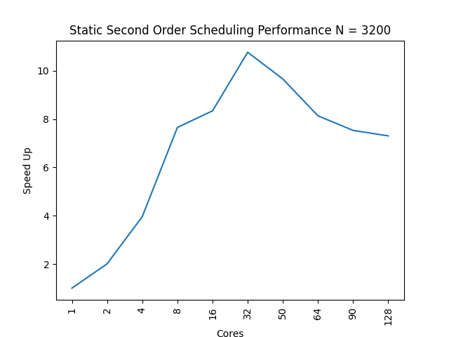
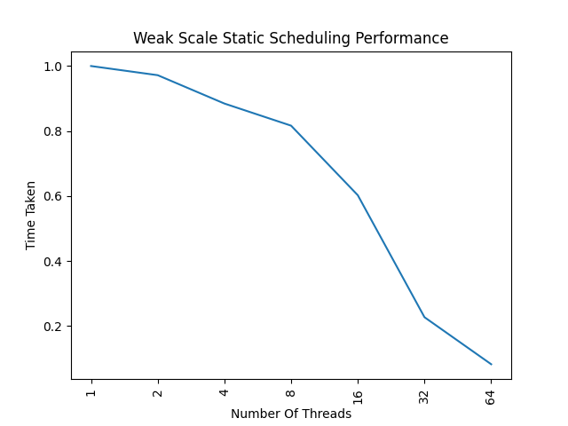

### Compiling serial code
> make my_advection_program  

### Compiling parallel code
> make my_advection_program_parallel  

### Executing 
> ./my_advection_program 400 20000 1.0 1.0e6 5.0e-7 2.85e-7 lax -1 -1

> ./my_advection_program 400 20000 1.0 1.0e6 5.0e-7 2.85e-7 first_order_upwind -1 -1

> ./my_advection_program 400 20000 1.0 1.0e6 5.0e-7 2.85e-7 second_order_upwind -1 -1

> ./my_advection_program_parallel 400 20000 1.0 1.0e6 5.0e-7 2.85e-7 lax 8 8

> ./my_advection_program_parallel 400 20000 1.0 1.0e6 5.0e-7 2.85e-7 first_order_upwind 8 8

> ./my_advection_program_parallel 400 20000 1.0 1.0e6 5.0e-7 2.85e-7 second_order_upwind 8 8

### Clean
> make clean

## GIFS
### Lax

### First Order Upwind

### Second Order Upwind

## GRAPHS
### Lax N = 200

### Lax N = 3200

### First Order Upwind N = 200

### First Order Upwind N = 3200

### Second Order Upwind N = 200

### Second Order Upwind N = 3200 

* All tests were run on a system which has 64 threads avaialble to the user
* compiler used gcc9
* grind rate: 3,636,363,636.3636363636 cells/sec
* Files 01_serial.txt and 01_parallel.txt were generated at timestamp NT=1000 using serial and parallel execution and have the same output. (./write_to_file_parallel 200 2000 1.0 1.0e3 5.0e-7 2.85e-7 lax -1 -1, ./write_to_file_parallel 200 2000 1.0 1.0e3 5.0e-7 2.85e-7 lax 8 8)
