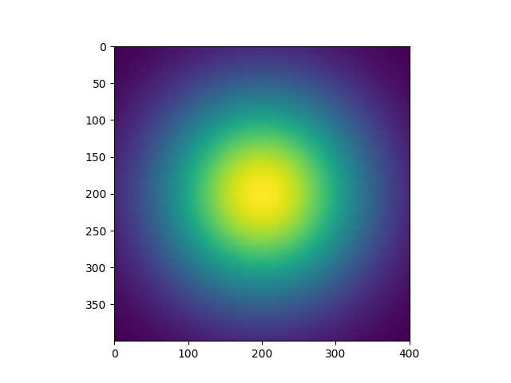
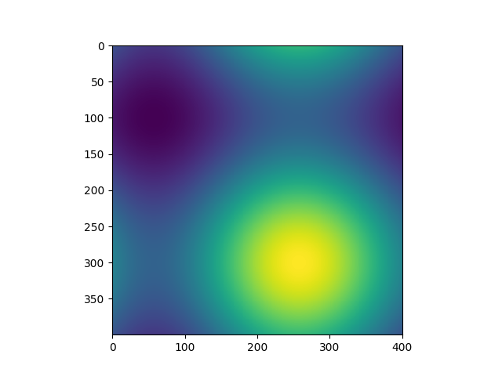
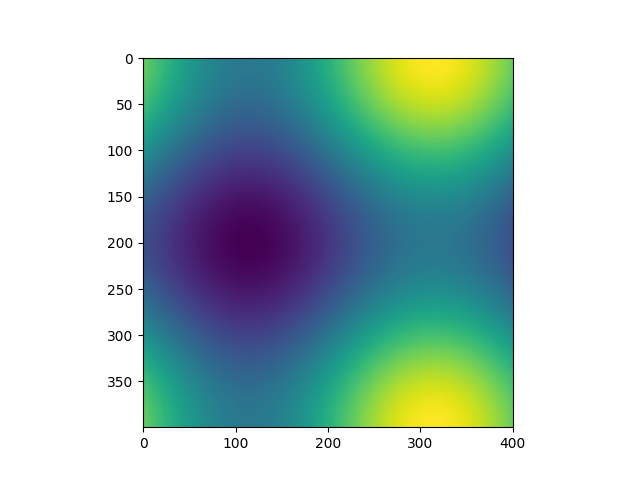
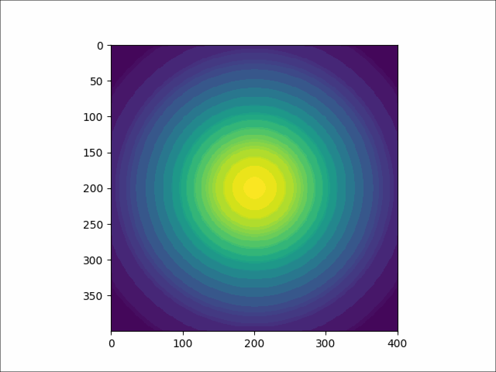

### Compiling
> make my_advection_program  
> or  
> gcc -std=c11 -Wall -Werror -pedantic -o my_advection_program advection.c -lm

### Executing 
> ./my_advection_program 400 20000 1.0 1.0e6 5.0e-7 2.85e-7

### Graph at timestamp 0

### Graph at timestamp 10000

### Graph at timestamp 20000

### GIF

### Clean
> make clean